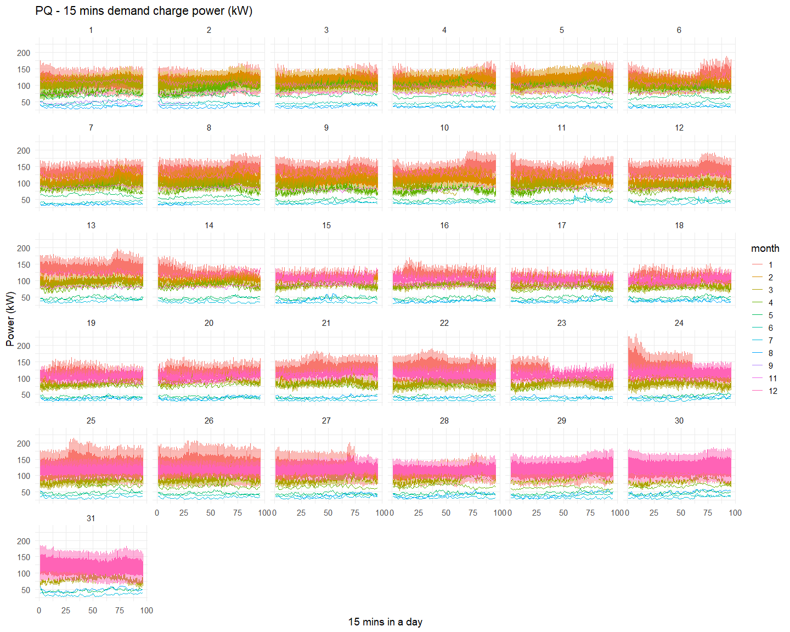
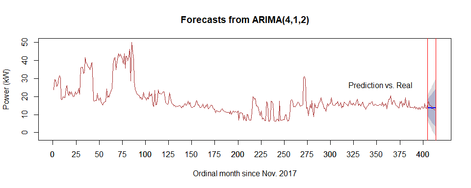
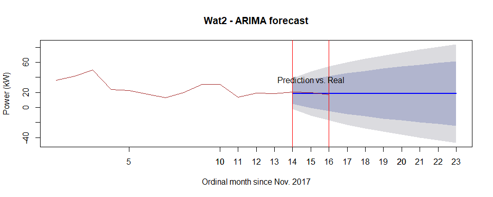
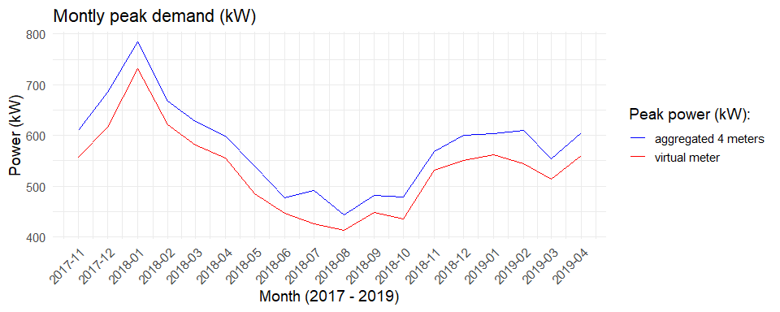
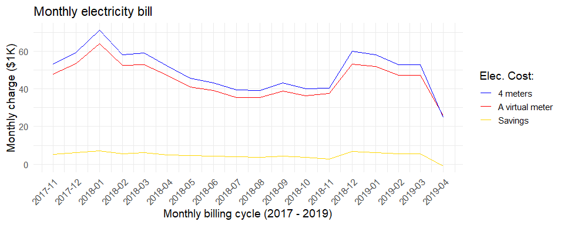
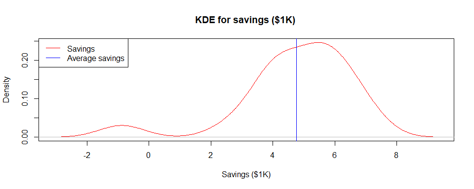

## R package: demand

This package creates diverse plots per day, weekday, month and year for peak demand power consumption of several meters to support a [project, demand_acep](https://github.com/demand-consults/demand_acep), which was developed to make raw data ready to use for the further analyses. These plots lead to benefit-cost analyses and cost saving plots. In addition, this package forecasts peak power demand using ARIMA on a daily and monthly basis. Correlation and a simple regression are also included. 

To use ths package, follow the steps:

1. Install `devtools`
```
install.packages("devtools")
```

2. Load the package 
```
library(devtools)
```

3. Install this package `demand`
```
install_github("reconjohn/demand")
```

3. Load the package 
```
library(demand)
```

Now you are all set!


## Examples are as follows: 

### Peak demand (kW) plot of day per month


### ARIMA forecast for predicting 10 days


### ARIMA forecast for predicting 3 months


### Peak demand comparison between a virtual meter and the 4 meters 


### Cost comparison and saving 


### Monthly saving distribution 



View the project [here](https://github.com/demand-consults/demand_acep).

---

To the extent possible under law,
[Yohan Min](https://github.com/reconjohn)
has waived all copyright and related or neighboring rights to
&ldquo;[R package demand](https://github.com/reconjohn/demand)&rdquo;.
This work is published from the United States.
